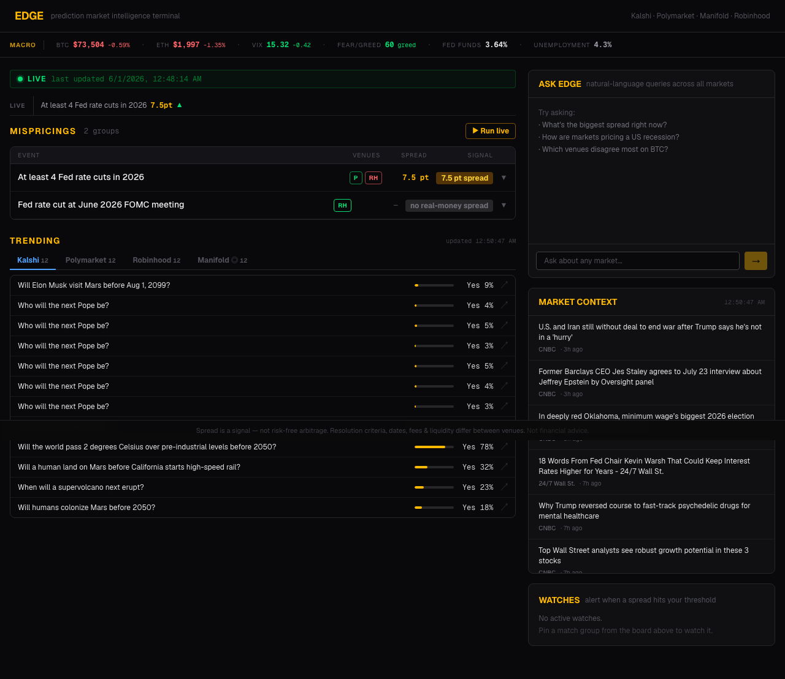
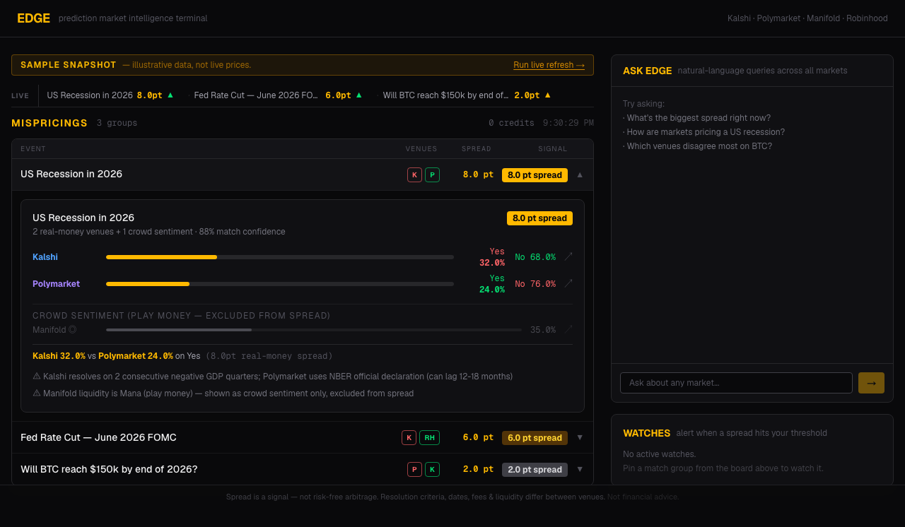

# Edge — Prediction Market Intelligence Terminal

> The internet's prediction markets, cross-checked for an edge.

Edge pulls live odds from Kalshi, Polymarket, Robinhood, and Manifold via Anakin Wire, uses an LLM to match the same real-world event across venues, and surfaces real-money mispricings — with resolution-difference caveats and an explicit play-money exclusion.

**Not financial advice.** Spreads are signals, not guaranteed risk-free arbitrage. Resolution criteria, dates, fees, and liquidity differ between venues.

**Live demo:** https://edge-eta.vercel.app (deployed in labeled SAMPLE SNAPSHOT mode; "Run live refresh" performs a real Wire ingest)

---

## Screenshots

The mispricings board — compact table, live spread ticker, green (cheaper) / red (richer) venue chips, amber spread badges:



Expanded match group — per-venue odds, play-money "crowd sentiment" excluded from the spread, resolution-difference caveats:



---

## The problem

The same event — a Fed rate decision, a BTC price level, a US recession — trades at different implied probabilities on different prediction markets. Kalshi might price "4 Fed rate cuts in 2026" at 1%, while Robinhood's count-contract prices imply 8%. That 7-point gap is real and live. Edge finds those gaps automatically.

---

## How it works

```
DISCOVER ──► INGEST ──► NORMALIZE ──► MATCH (LLM) ──► COMPARE ──► SURFACE
                                                                      │
                                                              CHAT (NL query)
                                                              WATCH (alerts)
```

1. **Discover/Ingest** — Anakin Wire fetches live markets from all 4 venues. Two strategies:
   - Generic pull: top open markets per venue
   - Targeted pull: known cross-venue events fetched by slug/ID (Fed FOMC, rate cut counts, BTC levels)

2. **Normalize** — per-venue parsers map each response to a common shape: `{ venue, title, outcomes[{name, impliedProb}], closeTime, liquidity, isPlayMoney, url }`. Manifold is flagged `isPlayMoney=true` (Mana, not USD).

3. **Match (LLM)** — OpenRouter (Claude Sonnet 4.6) clusters semantically-equivalent markets across venues with confidence scores and noted differences. Hard guards reject same-venue pairs, per-game vs series mismatches, and low-confidence groups.

4. **Compare** — within each group, compute the real-money spread (Kalshi, Polymarket, Robinhood only). Manifold is shown as "crowd sentiment" and excluded from the headline badge.

5. **Surface** — ranked mispricings board with green/red directional coloring, live spread ticker, chat panel, watch/alert system.

---

## Wire catalogs & actions used

**Prediction-market venues** (mispricings + trending):

| Venue | Wire action IDs |
|-------|----------------|
| Kalshi | `kl_events`, `kl_event_detail` |
| Polymarket | `pm_get_markets`, `pm_get_market` |
| Manifold | `mm_markets`, `mm_search_markets` |
| Robinhood | `rh_get_markets`, `rh_get_event`, `rh_get_categories` |

**Context catalogs** (macro ribbon + news, all cached in Postgres):

| Catalog | Action | Panel |
|---------|--------|-------|
| `cboe` | `cboe_volatility_index` | VIX |
| `fear_greed` | `fg_cnn_fear_greed` | CNN Fear & Greed |
| `coingecko` | `cg_coin_markets` | BTC + ETH price |
| `fred_stlouisfed` | `fr_series` | Fed funds + unemployment |
| `cnbc` | `cn_top_stories` | Market Context news |
| `google_news` | `gn_search` | Market Context news |

Targeted events tracked by slug/ID:
- `KXFED-26JUN` (Kalshi) — Fed June 2026 FOMC rate-level markets
- `fed-decision-in-jun-2026-jun-17-2026` (Robinhood) — Fed June cut/hold/hike
- `number-of-rate-cuts-in-2026-dec-31-2026` (Robinhood) — total 2026 cuts count (21 contracts → derived binary ≥4 cuts)
- Market ID `616906` (Polymarket) — "Will 4 Fed rate cuts happen in 2026?"

**Wire is the required sponsor technology.** All live market data routes through Wire Holocron actions.

---

## Service roles

| Service | Role |
|---------|------|
| **Anakin Wire (Holocron)** | ★ Star tech. All 4 venue pulls, all market prices |
| **OpenRouter** | LLM brain: market matching + NL chat synthesis |
| **Discord** | Webhook alerts when a watched spread crosses threshold |
| **Exa** | Optional supplementary news context (not core in this build) |

---

## Live vs sample data

Real-money cross-venue overlap is genuinely sparse and concentrated in large macro events — Fed decisions, elections, major crypto price levels. Exotic or short-term markets don't trade on multiple regulated venues simultaneously.

**The deployed app does a genuine end-to-end live Wire ingest.** Click **▶ Run live** and the board pulls real odds via Anakin Wire in ~2-3 min, then shows a green **● LIVE** banner with the run timestamp. A verified live result:
- **7.5pt AMBER** "At least 4 Fed rate cuts in 2026": Polymarket 1.1% vs Robinhood-derived 8.7%

### How live runs beat the serverless timeout

Wire jobs take ~2 min each, but no serverless function may run that long. Edge embraces Wire's async pattern, split across two short calls:
- **`POST /api/ingest/start`** — submits all Wire tasks (just the POSTs), stores the returned `job_id`s in Postgres with `status=pending`, returns a `runId` immediately (<60s). Dedupes any in-flight run.
- **`GET /api/ingest/status?run=ID`** — the frontend polls this every 3s. Each call does a *single* status check per pending job (no blocking), normalizes + upserts any that completed, and when all jobs are in, runs LLM matching once and stores the groups. Returns per-venue progress + groups-so-far. Handles 429 with soft backoff and partial success.

The board defaults to the **most recent completed live run** from Postgres ("● LIVE · last updated {time}"). The labeled **SAMPLE SNAPSHOT** appears only as a fallback when no completed run exists yet. Credits are spent only on an explicit button click, never on page load.

Manifold markets appear as "crowd sentiment" (grey, de-emphasized) and never drive the amber real-money badge.

---

## Run locally

```bash
git clone https://github.com/keshavojha/edge
cd edge
npm install
cp .env.example .env
# Fill ANAKIN_API_KEY, OPENROUTER_API_KEY, and DATABASE_URL (Postgres) in .env
npx prisma migrate dev
npm run dev       # http://localhost:3000
```

Edge uses **Postgres** (Neon/Supabase/Vercel Postgres via `DATABASE_URL`) so the
async run state persists on serverless. Then in the app click **▶ Run live**, or
drive the API directly:
```bash
RUN=$(curl -s -X POST localhost:3000/api/ingest/start | jq -r .runId)
# poll every ~3s until done
curl -s "localhost:3000/api/ingest/status?run=$RUN" | jq '{status, jobs, groups: (.groups|length)}'
```

---

## Deploy to Vercel

```bash
vercel --prod
```

Environment variables (Vercel dashboard):
```
ANAKIN_API_KEY=...
OPENROUTER_API_KEY=...
OPENROUTER_MODEL=anthropic/claude-sonnet-4.6
DATABASE_URL=postgres://...    # Neon (via Vercel marketplace), Supabase, etc.
DEMO_MODE=false                # false = live runs default, demo is fallback
DISCORD_WEBHOOK_URL=...        # optional: spread alerts
CRON_SECRET=...                # optional: secure the cron endpoint
```

The deployed instance uses Neon Postgres provisioned through the Vercel
marketplace integration (`vercel integration add neon`), which auto-sets
`DATABASE_URL` across environments.

---

## What "edge" means (and doesn't)

A spread between venues is a signal that the crowd disagrees. It is **not** necessarily a risk-free arbitrage. Common structural reasons for spreads:
- Resolution criteria differ (e.g. Kalshi "2 negative GDP quarters" vs Polymarket "NBER declaration")
- Close dates differ by days
- Different user bases have different priors
- Liquidity differences let prices drift

Edge surfaces the spread and flags likely reasons. It does not recommend trading.

**Not financial advice.**
